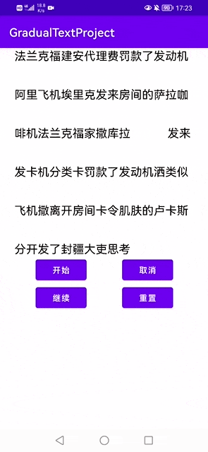
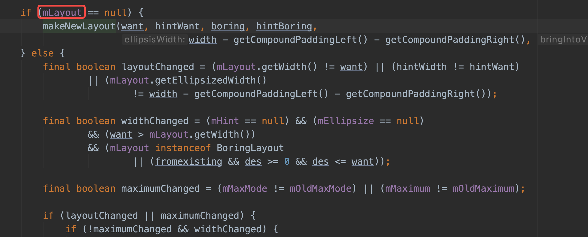
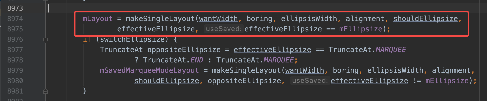
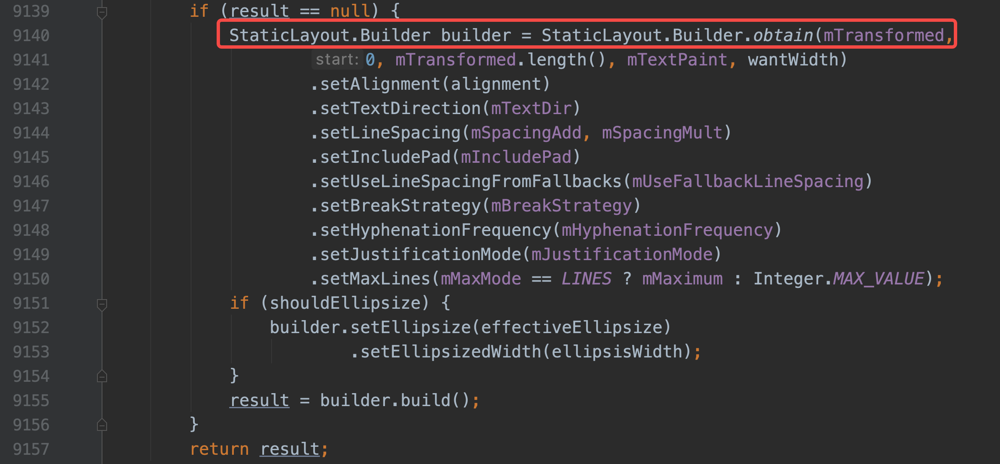
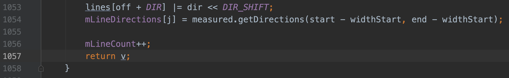

# GradualShowTextView

### 一.效果展示



### 二.简单梳理一下系统TextView换行以及读取每行内容的原理



在onMeasure里面有一个`mLayout`的变量，上述截图前会通过`mLayout`拿到文本宽高的测量值，显然，第一次Measure的时候，它为空，所以进入`makeNewLayout`构造一个实例



随后进入到`makeSingleLayout`方法中



经过调试，发现`mLayout`会通过`StaticLayout`来生成，下面进入到它的构造函数里，会看到末尾有执行了`generate`方法，里面的流程稍微复杂，只需要找和行数相关的代码即可，随后定位到`out`函数的调用处



看到这里其实也就差不多了，具体换行的逻辑貌似是通过`LineBreaker`来管理的，大致流程走通后，对于自定义一个TextView就很简单了，只需要通过`mLayout`来获取到行数，每一行的具体内容，都有相应的api供使用，剩余的工作就是绘制了，这里一笔带过

### 三.坑点和思路分析

- 首先通过上述的源码分析，通过`getLayout`就能拿到对应的`mLayout`，进而拿到行数，以及每一行的文本内容，这就省去了我们来思考换行以及测量的逻辑，当然这里需要进行一层封装，在init代码块中进行数据准备
- 测量，测量比较简单，只需要在原有测量的基础上进行扩展即可，加上每行的间距(如果有)
- 绘制，为了防止过度绘制，这里进行了画布剪裁，此外也需回顾文本如何设置中心线的问题
- 在实现动画的过程中，发现cancel结束后是会走end的，这种情况就需要额外的标志判断
- 在暂停动画，也就是取消动画后，再次开始需要在上次完成的进度基础上来设置动画时长，否则会变得很慢

整体来说比较简单，具体逻辑移步代码查看

### 四.使用方式

```
dependencies {
    implementation 'io.github.wiwi289:GradualShowTextView:1.0.0'
}
```

可能会使用到的属性：

|        属性值         |         属性描述         |
| :-------------------: | :----------------------: |
| background_text_color | 设置开始动画前的文本颜色 |
| foreground_text_color | 动画开始的前景色(覆盖色) |
|      line_space       |          行间距          |
|  line_animation_time  |     每行动画执行时间     |

具体使用案例也可查看demo

[博客](https://wiwiyiyi.com)